# Freaky-Fashion

## Table of Contents

- [Screenshots](#screenshots)
- [Project Overview](#project-overview)
- [Technologies Used](#technologies-used)
- [Prerequisites](#prerequisites)
- [Environment Setup](#environment-setup)
- [Getting Started](#getting-started)
  - [Clone the Repository](#1-clone-the-repository)
  - [Backend Setup](#2-backend-setup)
  - [Frontend Setup](#3-frontend-setup)
- [Database Setup](#database-setup)
  - [Automatic Database Initialization](#automatic-database-initialization)
  - [Creating an Admin User](#creating-an-admin-user)
  - [Database Schema](#database-schema)
- [Folder Structure Overview](#folder-structure-overview)
- [Admin Access](#admin-access)
  - [Accessing the Admin Panel](#accessing-the-admin-panel)
  - [Admin Features](#admin-features)
  - [Admin Routes](#admin-routes)
- [API Documentation](#api-documentation)
  - [Products Endpoints](#products-endpoints)
  - [Categories Endpoints](#categories-endpoints)
  - [Admin Endpoints](#admin-endpoints)
  - [User Endpoints](#user-endpoints)
  - [Response Formats](#response-formats)
  - [CORS Configuration](#cors-configuration)

## Screenshots

### Homepage
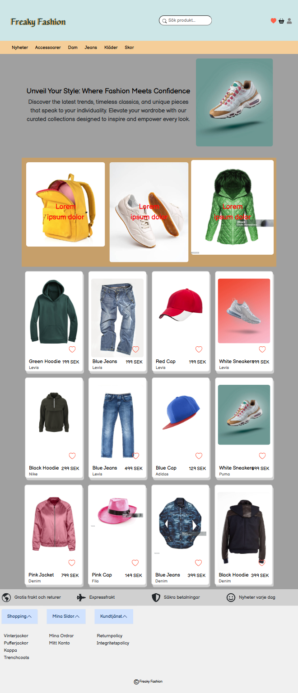
*Main landing page with featured products and hero section*

### Product Listing
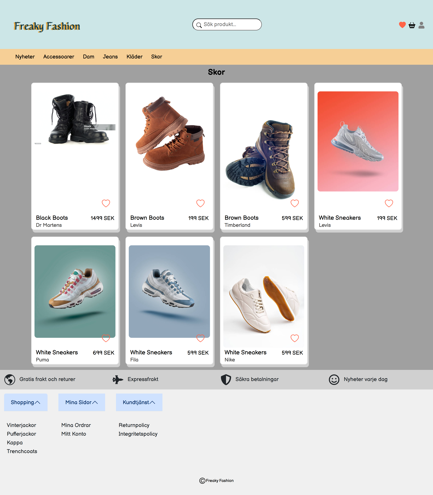
*Browse products with category filtering*

### Product Details
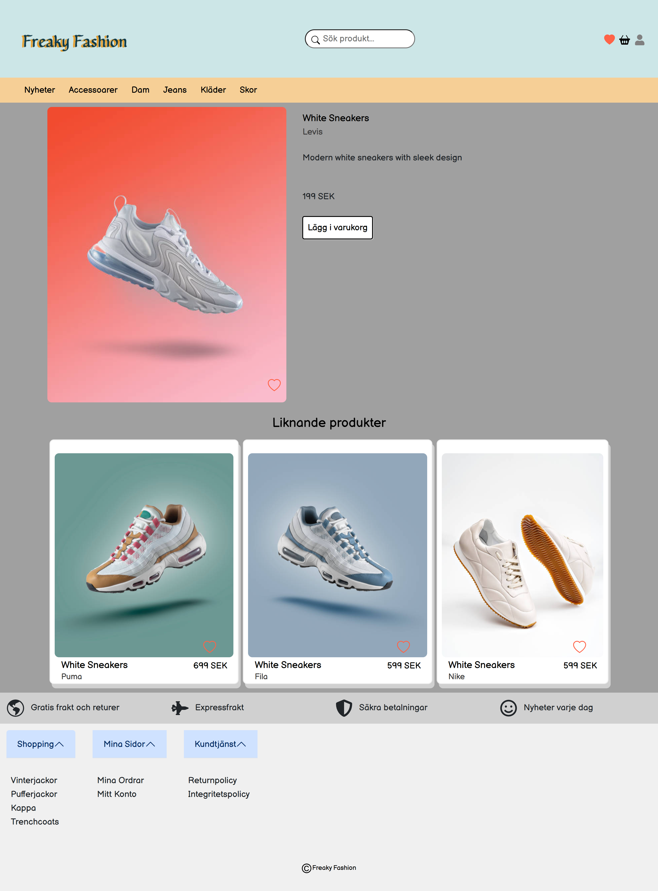
*Detailed product view with add to cart and favorites*

### Search Results
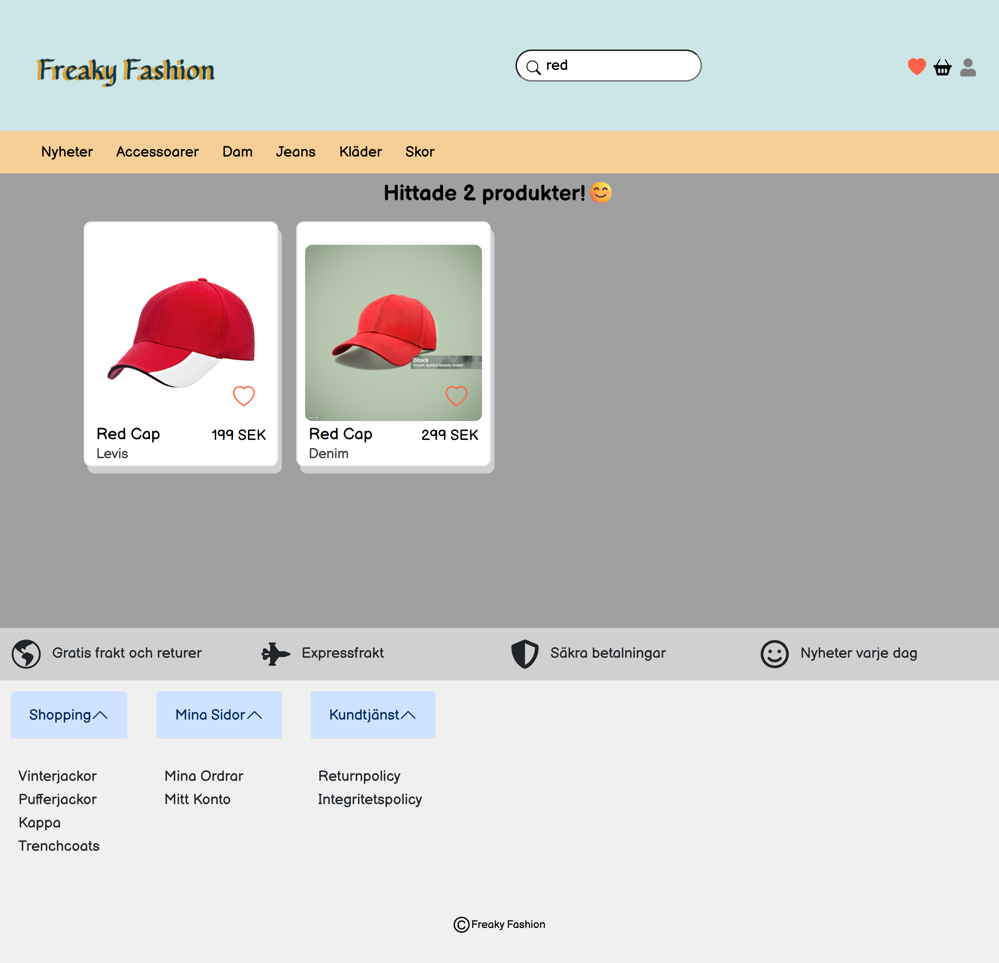
*Search functionality displaying matching products*

### Shopping Cart
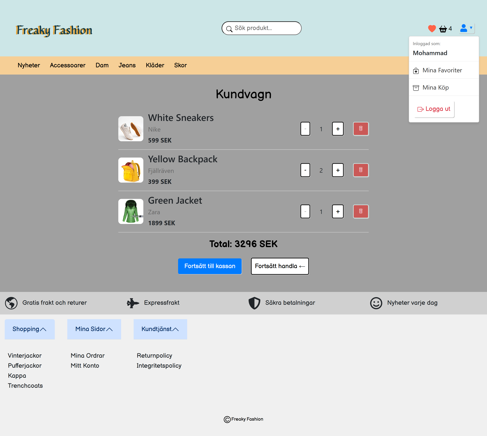
*Shopping cart with quantity management*

### Favorites
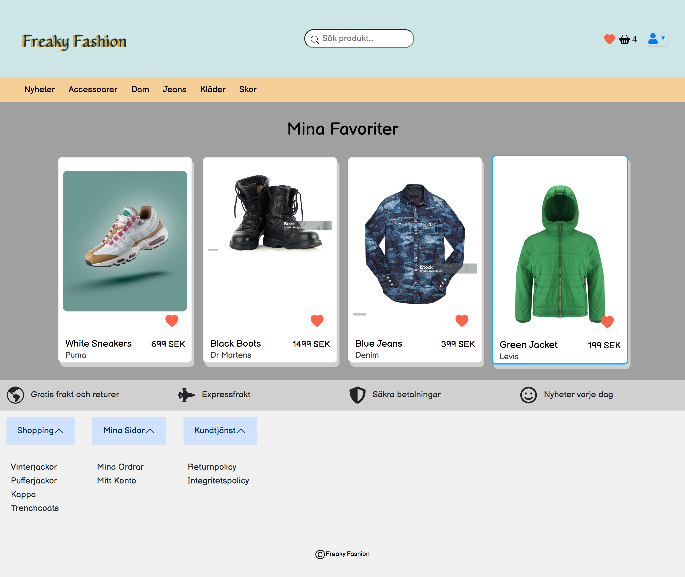
*User favorites list for quick access to saved products*

### User Login
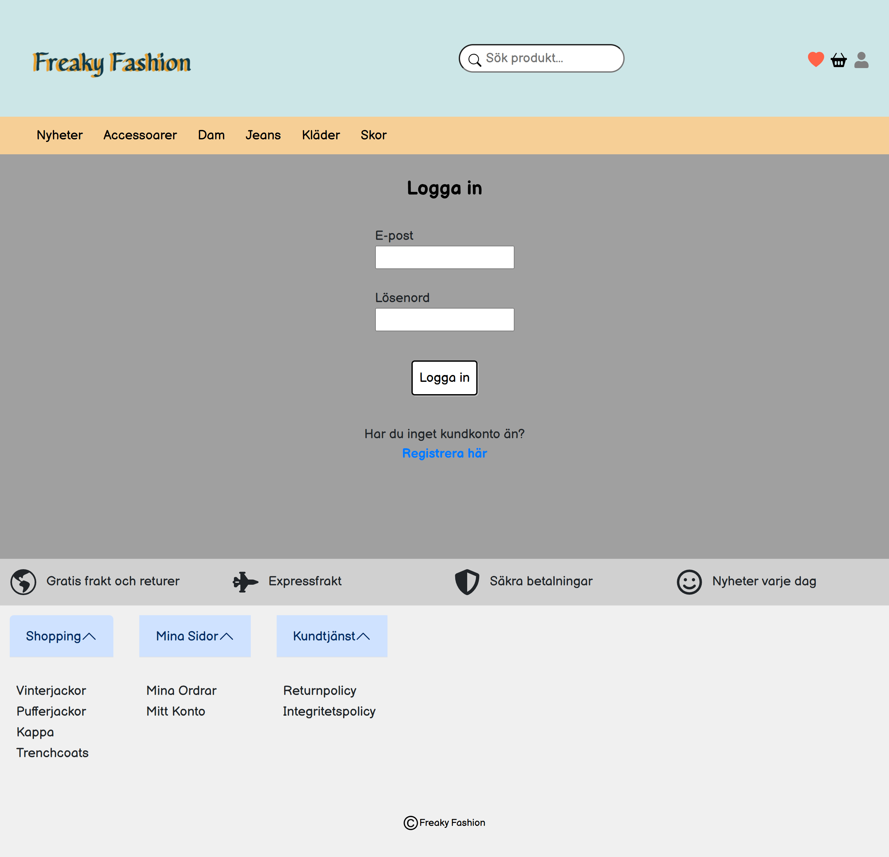
*User authentication page*

### User Registration
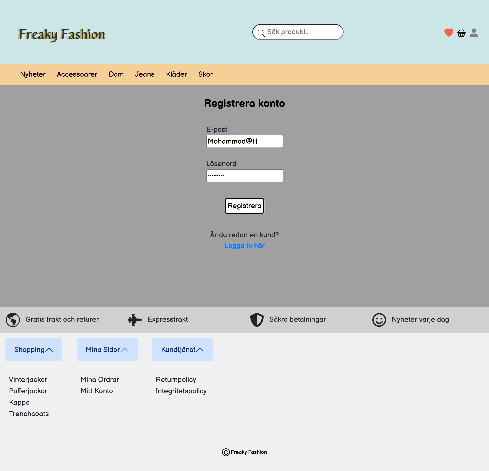
*New user registration form*

### Authentication Architecture

*Complete JWT authentication architecture with access tokens, refresh tokens, and automatic token refresh flow*

### Admin Dashboard - Products
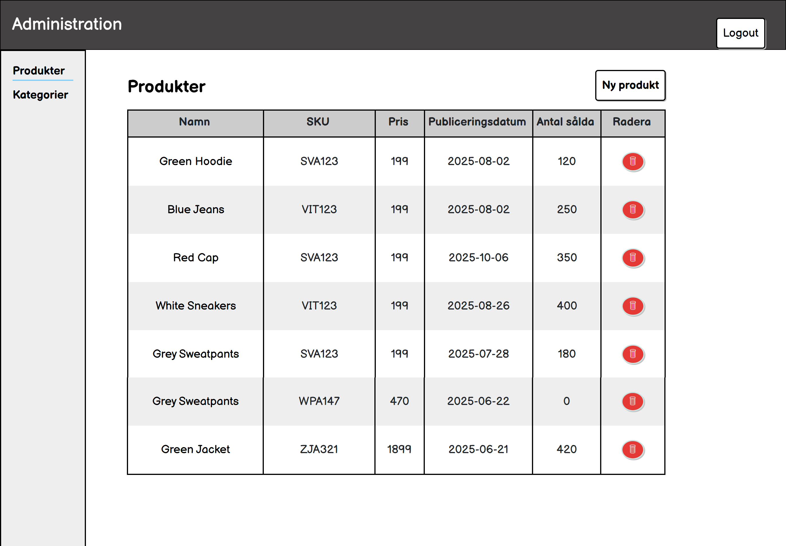
*Admin interface for managing products*

### Admin Dashboard - Categories
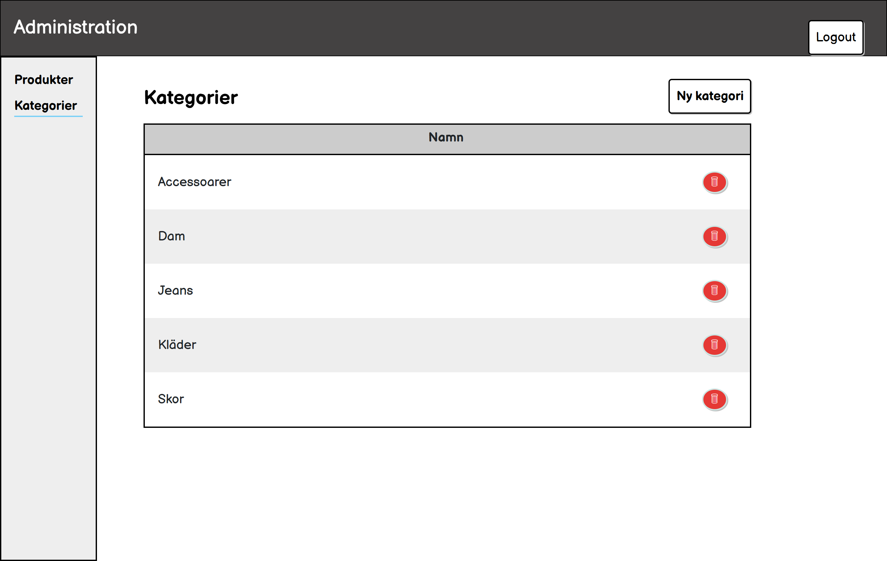
*Admin interface for managing product categories*

### Admin Dashboard - Add Product
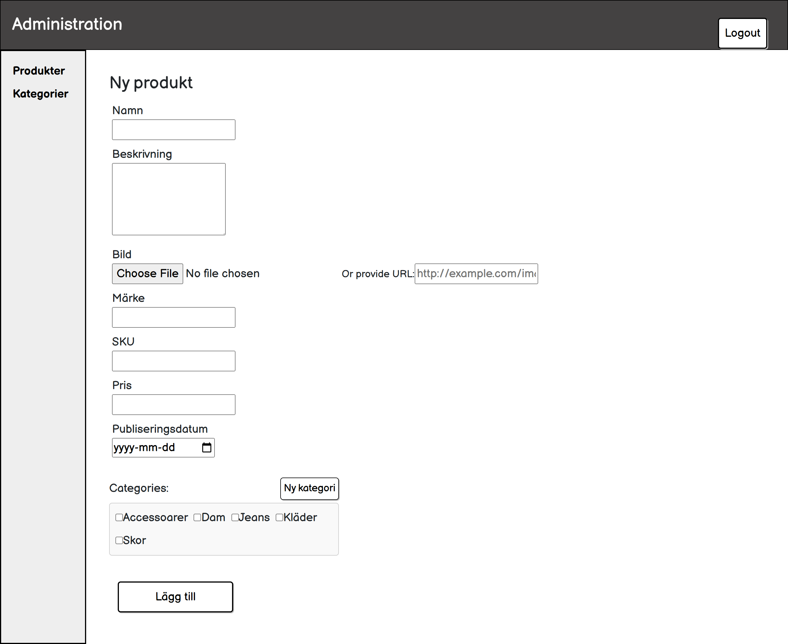
*Form for adding new products with image upload*

## Project Overview

Freaky-Fashion is a full-stack e-commerce web application built with a modern tech stack. The application allows users to browse fashion products, manage their shopping cart, add items to favorites, and perform secure user authentication. It also includes an admin panel for managing products and categories, enabling administrators to add, edit, and delete products and categories.

Key features include:
- User registration and login with JWT authentication
- Product browsing with categories
- Shopping cart functionality
- Favorites list
- Admin dashboard for product and category management (requires JWT authentication)
- Image upload for products
- Responsive design using Bootstrap
- Secure JWT-based authentication with refresh tokens and HttpOnly cookies
- Password hashing with bcrypt and salt/pepper security
- Automatic token refresh for seamless user experience

## Technologies Used

### Backend
- **Node.js**: JavaScript runtime for server-side development
- **Express.js**: Web framework for building RESTful APIs
- **SQLite**: Lightweight database using better-sqlite3
- **CORS**: Cross-Origin Resource Sharing for API access
- **JWT (jsonwebtoken)**: JSON Web Tokens for stateless authentication
- **bcrypt**: Password hashing with salt and pepper security
- **cookie-parser**: HttpOnly cookie management for refresh tokens
- **multer**: Middleware for handling file uploads (product images)
- **dotenv**: Environment variable management

### Frontend
- **React**: JavaScript library for building user interfaces
- **Vite**: Fast build tool and development server
- **Axios**: Promise-based HTTP client with interceptors for API requests and automatic token refresh
- **Bootstrap**: CSS framework for responsive design
- **React Router DOM**: Routing library for single-page applications
- **React Icons**: Icon library for UI elements

## Prerequisites

Before running this project, ensure you have the following installed:

- **Node.js**: Version 18.x or higher recommended
- **npm**: Comes with Node.js (version 9.x or higher)
- **Git**: For version control

To check your current versions:
```bash
node --version
npm --version
```

## Environment Setup

### Backend Environment Variables

Create a `.env` file in the `backend` directory with the following variables:

```env
# Server Configuration
SERVER_URL=http://localhost:8000
PORT=8000

# Security Secrets (CHANGE IN PRODUCTION!)
PEPPER_SECRET=your-pepper-secret-here-change-this-in-production
JWT_SECRET=your-jwt-secret-here-change-this-in-production
JWT_REFRESH_SECRET=your-jwt-refresh-secret-here-change-this-in-production

# JWT Configuration
JWT_EXPIRES_IN=15m
BCRYPT_ROUNDS=10
```

**Environment Variables Explained:**
- `SERVER_URL`: Backend server URL (used for image upload paths)
- `PORT`: Port number for the backend server (default: 8000)
- `PEPPER_SECRET`: Additional secret for password hashing (minimum 32 characters recommended)
- `JWT_SECRET`: Secret key for signing access tokens (minimum 32 characters recommended)
- `JWT_REFRESH_SECRET`: Secret key for signing refresh tokens (minimum 32 characters recommended)
- `JWT_EXPIRES_IN`: Access token expiration time (default: 15 minutes)
- `BCRYPT_ROUNDS`: Number of bcrypt hashing rounds (default: 10, higher = more secure but slower)

**Security Note:**
- Never commit your `.env` file to version control. It should be listed in `.gitignore`
- Use strong, random strings for all secrets in production (minimum 32 characters)
- Keep JWT_SECRET and JWT_REFRESH_SECRET different from each other

## Getting Started

Follow these steps to set up and run the application locally:

### 1. Clone the Repository

```bash
git clone <repository-url>
cd Freaky-Fashion
```

### 2. Backend Setup

1. Navigate to the backend directory:
   ```bash
   cd backend
   ```

2. Install dependencies:
   ```bash
   npm install
   ```

3. Create a `.env` file (see Environment Setup section above)

4. Start the development server:
   ```bash
   npm run dev
   ```

The backend server will be running on `http://localhost:8000`.

**Available Backend Scripts:**
- `npm start` - Run the server in production mode
- `npm run dev` - Run the server with nodemon (auto-restart on changes)

### 3. Frontend Setup

1. Open a new terminal and navigate to the frontend directory:
   ```bash
   cd frontend
   ```

2. Install dependencies:
   ```bash
   npm install
   ```

3. Start the development server:
   ```bash
   npm run dev
   ```

The frontend will be running on `http://localhost:3000`.

**Available Frontend Scripts:**
- `npm run dev` - Start development server
- `npm run build` - Build for production
- `npm run preview` - Preview production build
- `npm run lint` - Run ESLint

**Important:** Ensure the backend is running before starting the frontend, as the frontend makes API calls to the backend.

## Database Setup

The application uses SQLite as its database, which will be automatically initialized when you first run the backend server.

### Automatic Database Initialization

When you start the backend for the first time, the following tables are automatically created:

- **users** - User accounts with authentication
- **products** - Product catalog
- **categories** - Product categories
- **product_categories** - Many-to-many relationship between products and categories
- **favorites** - User favorite products
- **cart** - Shopping cart items

The database file is created at: `backend/db/fashion.db`

### Creating an Admin User

The application uses a secure admin setup process through the web interface.

**First-Time Admin Setup:**

1. Start the backend and frontend servers
2. Navigate to `http://localhost:3000/admin`
3. The first time you visit the admin panel, you'll see a "Setup Admin" form
4. Create your admin account with:
   - Username (email format recommended)
   - Password (will be securely hashed with bcrypt)
5. Click "Setup Admin Account"
6. You'll be automatically logged in

**Creating Additional Admin Users:**

Once logged in as an admin, you can create additional admin accounts:

1. Navigate to Admin panel
2. Go to "Register Admin" page
3. Create new admin credentials
4. The new admin can now log in with their credentials

**Security Features:**
- All passwords are securely hashed using bcrypt with salt and pepper
- Passwords are NEVER stored in plain text
- JWT-based authentication with access and refresh tokens
- HttpOnly cookies for enhanced security
- Automatic token refresh for seamless sessions

### Database Schema

**users table:**
```sql
id INTEGER PRIMARY KEY AUTOINCREMENT
username TEXT UNIQUE NOT NULL
password TEXT NOT NULL              -- bcrypt hashed with salt + pepper
role TEXT DEFAULT 'user'
refresh_token TEXT                  -- JWT refresh token for session management
created_at DATETIME DEFAULT CURRENT_TIMESTAMP
```

**products table:**
```sql
id INTEGER PRIMARY KEY AUTOINCREMENT
name TEXT NOT NULL
description TEXT
brand TEXT
sku TEXT
price REAL NOT NULL
imageUrl TEXT
totalSales INTEGER DEFAULT 0
publicationDate TEXT
```

**categories table:**
```sql
id INTEGER PRIMARY KEY AUTOINCREMENT
name TEXT UNIQUE NOT NULL
```

Other tables: `product_categories`, `favorites`, `cart` (see backend/db.js for full schema)

## Folder Structure Overview

```
Freaky-Fashion/
├── screenshots/                      # Application screenshots for documentation
│   ├── homepage.png
│   ├── product-listing.png
│   ├── product-details.png
│   ├── search-results.png
│   ├── cart.png
│   ├── favorites.png
│   ├── login.png
│   ├── register.png
│   ├── admin-products.png
│   ├── admin-categories.png
│   └── admin-add-product.png
├── backend/                          # Backend application
│   ├── db/                           # Database files
│   │   └── fashion.db                # SQLite database
│   ├── logs/                         # Log files
│   ├── public/                       # Static files
│   │   └── images/
│   │       └── products/             # Uploaded product images
│   ├── routes/                       # API route handlers
│   │   ├── admin.js                  # Admin-related routes (JWT protected)
│   │   ├── categories.js             # Category management routes
│   │   ├── products.js               # Product management routes
│   │   └── users.js                  # User authentication routes (JWT)
│   ├── utils/                        # Utility functions
│   │   └── authMiddleware.js         # JWT authentication middleware
│   ├── db.js                         # Database initialization
│   ├── package.json                  # Backend dependencies and scripts
│   ├── package-lock.json             # Backend lockfile
│   └── server.js                     # Main server file
├── frontend/                         # Frontend application
│   ├── public/
│   │   └── assets/                   # Static assets (logo, icons)
│   ├── src/
│   │   ├── components/               # Reusable UI components
│   │   │   ├── CategoriesTable/      # Admin categories table
│   │   │   ├── FilterSidebar/        # Product filtering sidebar
│   │   │   ├── FooterNav/            # Footer navigation
│   │   │   ├── Header/               # Main header
│   │   │   ├── Hero/                 # Hero section
│   │   │   ├── IconsBar/             # Icon navigation bar
│   │   │   ├── NewProductForm/       # Product creation form
│   │   │   ├── ProductCardGrid/      # Product grid display
│   │   │   ├── ProductDetails/       # Product detail view
│   │   │   ├── ProductsTable/        # Admin products table
│   │   │   ├── SimilarProduct/       # Similar products component
│   │   │   ├── Spots/                # Featured spots
│   │   │   ├── TopNav/               # Top navigation
│   │   │   ├── Login.jsx             # Login component
│   │   │   └── UserMenu.jsx          # User menu dropdown
│   │   ├── contexts/                 # React contexts for state management
│   │   │   ├── AuthContext.jsx       # Authentication context
│   │   │   ├── CartContext.jsx       # Shopping cart context
│   │   │   └── FavContext.jsx        # Favorites context
│   │   ├── hooks/                    # Custom React hooks
│   │   ├── layouts/                  # Layout components
│   │   │   ├── AdminLayout.jsx       # Admin page layout
│   │   │   └── PublicLayout.jsx      # Public page layout
│   │   ├── pages/                    # Page components
│   │   │   ├── admin/                # Admin pages
│   │   │   │   ├── AdminCategories.jsx
│   │   │   │   ├── AdminProducts.jsx
│   │   │   │   ├── AdminRegister.jsx # Admin registration page
│   │   │   │   ├── NewCategory.jsx
│   │   │   │   └── NewProduct.jsx
│   │   │   └── public/               # Public pages
│   │   │       ├── Cart.jsx
│   │   │       ├── Category.jsx
│   │   │       ├── Favorites.jsx
│   │   │       ├── Home.jsx
│   │   │       ├── Login.jsx
│   │   │       ├── Nyheter.jsx
│   │   │       ├── Product.jsx
│   │   │       ├── Profile.jsx       # User profile page
│   │   │       ├── Register.jsx
│   │   │       └── SearchResults.jsx
│   │   ├── services/                 # API services
│   │   │   └── api.js                # Axios client with auto-refresh
│   │   ├── utils/                    # Utility functions
│   │   ├── App.css                   # Main app styles
│   │   ├── App.jsx                   # Main app component
│   │   ├── index.css                 # Global styles
│   │   └── main.jsx                  # App entry point
│   ├── .gitignore                    # Git ignore file
│   ├── eslint.config.js              # ESLint configuration
│   ├── index.html                    # HTML template
│   ├── package.json                  # Frontend dependencies and scripts
│   ├── package-lock.json             # Frontend lockfile
│   ├── README.md                     # Frontend README (Vite template)
│   └── vite.config.js                # Vite configuration
├── .gitignore                        # Root git ignore
├── IMPLEMENTATION_SUMMARY.md         # Comprehensive JWT implementation documentation
├── TESTING_REFRESH_TOKEN_FIX.md      # Refresh token testing guide
└── README.md                         # This file
```

## Admin Access

The admin panel allows you to manage products and categories through a web interface with secure JWT authentication.

### Accessing the Admin Panel

1. **First-Time Setup:**
   - Navigate to: `http://localhost:3000/admin`
   - If no admin exists, you'll see the "Setup Admin" form
   - Create your admin account (username and password)
   - You'll be automatically logged in after setup

2. **Subsequent Logins:**
   - Navigate to: `http://localhost:3000/admin`
   - Enter your admin credentials
   - JWT tokens will be issued for secure access

3. **Session Management:**
   - Access tokens expire after 15 minutes
   - Refresh tokens are valid for 7 days
   - Automatic token refresh keeps you logged in seamlessly
   - Logout invalidates all tokens for security

### Admin Features

Once logged in, you can:

**Product Management:**
- View all products in a table format
- Add new products with details (name, description, brand, SKU, price, image)
- Upload product images (JPEG, JPG, PNG, WebP - max 10MB)
- Assign products to multiple categories
- Delete products
- Track product publication dates and total sales

**Category Management:**
- View all categories
- Create new categories
- Delete categories (will remove product-category associations)

**Image Upload:**
- Supported formats: JPEG, JPG, PNG, WebP
- Maximum file size: 10MB
- Images are stored in: `backend/public/images/products/`
- Images are automatically renamed with timestamp for uniqueness

### Admin Routes

The following admin endpoints are available:

- `POST /admin/setup` - Initial admin account creation (only when no admin exists)
- `POST /admin/login` - Admin authentication (returns JWT tokens)
- `POST /admin/register` - Create additional admin accounts (requires JWT auth)
- `POST /admin/refresh` - Refresh access token using refresh token cookie
- `POST /admin/logout` - Logout and invalidate refresh token
- `POST /admin/products` - Create new product (requires JWT auth)
- `DELETE /admin/products/:id` - Delete product (requires JWT auth)
- `POST /admin/categories` - Create new category (requires JWT auth)
- `DELETE /admin/categories/:id` - Delete category (requires JWT auth)
- `POST /admin/upload-image` - Upload product image (requires JWT auth)

All admin routes (except setup, login, and refresh) require JWT authentication via Authorization header.

## API Documentation

The backend provides a RESTful API for managing products, categories, users, favorites, and shopping cart.

**Base URL:** `http://localhost:8000`

### Products Endpoints

| Method | Endpoint | Description | Auth Required |
|--------|----------|-------------|---------------|
| GET | `/products` | Get all products | No |
| GET | `/products/recent` | Get products from last 7 days | No |
| GET | `/products/:id` | Get product by ID | No |
| GET | `/products/:id/:name` | Get product by ID and name | No |

### Categories Endpoints

| Method | Endpoint | Description | Auth Required |
|--------|----------|-------------|---------------|
| GET | `/categories` | Get all categories | No |
| GET | `/categories/:categoryId` | Get products by category | No |
| GET | `/categories/name/:categoryId` | Get category name by ID | No |

### Admin Endpoints

| Method | Endpoint | Description | Auth Required |
|--------|----------|-------------|---------------|
| POST | `/admin/setup` | Initial admin creation (first time only) | No |
| POST | `/admin/login` | Admin login (returns JWT tokens) | No |
| POST | `/admin/register` | Create additional admin (requires admin JWT) | Yes (Admin) |
| POST | `/admin/refresh` | Refresh access token | No (uses httpOnly cookie) |
| POST | `/admin/logout` | Logout and invalidate tokens | No |
| POST | `/admin/upload-image` | Upload product image | Yes (Admin JWT) |
| POST | `/admin/products` | Create new product | Yes (Admin JWT) |
| DELETE | `/admin/products/:id` | Delete product | Yes (Admin JWT) |
| POST | `/admin/categories` | Create new category | Yes (Admin JWT) |
| DELETE | `/admin/categories/:id` | Delete category | Yes (Admin JWT) |

**Admin Setup Body (First Time Only):**
```json
{
  "username": "admin@example.com",
  "password": "your-secure-password"
}
```

**Admin Login Body:**
```json
{
  "username": "admin@example.com",
  "password": "your-password"
}
```

**Admin Login Response:**
```json
{
  "accessToken": "eyJhbGciOiJIUzI1NiIsInR5cCI6IkpXVCJ9...",
  "user": {
    "id": 1,
    "username": "admin@example.com",
    "role": "admin"
  }
}
```
Note: Refresh token is automatically set as httpOnly cookie

**Create Product Body:**
```json
{
  "name": "Product Name",
  "description": "Product description",
  "brand": "Brand Name",
  "sku": "SKU123",
  "price": 299.99,
  "imageUrl": "/public/images/products/image.jpg",
  "categoryIds": [1, 2, 3]
}
```

**Create Category Body:**
```json
{
  "name": "Category Name"
}
```

### User Endpoints

| Method | Endpoint | Description | Auth Required |
|--------|----------|-------------|---------------|
| POST | `/users/register` | Register new user (returns JWT tokens) | No |
| POST | `/users/login` | User login (returns JWT tokens) | No |
| POST | `/users/refresh` | Refresh access token | No (uses httpOnly cookie) |
| POST | `/users/logout` | Logout and invalidate tokens | No |
| GET | `/users/me` | Get current user profile | Yes (User JWT) |
| GET | `/users/favorites/:userId` | Get user favorites | Yes (User JWT) |
| POST | `/users/favorites` | Add to favorites | Yes (User JWT) |
| DELETE | `/users/favorites/:userId/:productId` | Remove from favorites | Yes (User JWT) |
| POST | `/users/favorites/sync` | Sync anonymous favorites | Yes (User JWT) |
| GET | `/users/cart/:userId` | Get user cart | Yes (User JWT) |
| POST | `/users/cart` | Add to cart | Yes (User JWT) |
| PUT | `/users/cart` | Update cart quantity | Yes (User JWT) |
| DELETE | `/users/cart/:userId/:productId` | Remove from cart | Yes (User JWT) |
| POST | `/users/cart/sync` | Sync anonymous cart | Yes (User JWT) |

**Register Body:**
```json
{
  "email": "user@example.com",
  "password": "your-secure-password"
}
```

**Login Body:**
```json
{
  "username": "user@example.com",
  "password": "your-password"
}
```

**Login Response:**
```json
{
  "accessToken": "eyJhbGciOiJIUzI1NiIsInR5cCI6IkpXVCJ9...",
  "user": {
    "id": 1,
    "username": "user@example.com",
    "role": "user"
  }
}
```
Note: Refresh token is automatically set as httpOnly cookie

**Add to Favorites Body:**
```json
{
  "userId": 1,
  "productId": 5
}
```

**Add to Cart Body:**
```json
{
  "userId": 1,
  "productId": 5,
  "quantity": 2
}
```

**Update Cart Body:**
```json
{
  "userId": 1,
  "productId": 5,
  "quantity": 3
}
```

### Response Formats

**Success Response:**
```json
{
  "success": true,
  "data": { ... }
}
```

**Error Response:**
```json
{
  "success": false,
  "error": "Error message"
}
```

### CORS Configuration

CORS is enabled for the frontend origin: `http://localhost:3000`

Credentials are supported for JWT authentication and HttpOnly cookies.

**Configuration:**
```javascript
app.use(cors({
  origin: 'http://localhost:3000',
  credentials: true  // Required for httpOnly cookies
}));
```

### Authentication Flow

**JWT Token Strategy:**
- **Access Token**: Short-lived (15 minutes), stored in memory (React state)
- **Refresh Token**: Long-lived (7 days), stored in httpOnly cookie and database
- **Auto-Refresh**: Axios interceptor automatically refreshes expired tokens
- **Security**: HttpOnly cookies prevent XSS attacks, bcrypt protects passwords

For detailed implementation documentation, see [IMPLEMENTATION_SUMMARY.md](IMPLEMENTATION_SUMMARY.md)
